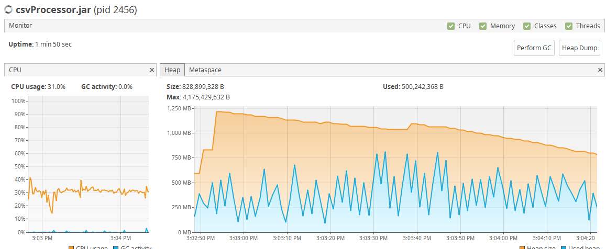

# simp-csv-processor

Process CSV stream on custom TCP port

## Get sources

```
git clone git@github.com:AndreyShchagin/simp-csv-processor.git
```

## Build
 With Maven: jar will be placed in target/
 ```
 mvn clean package
 ```
 
 Without maven: jar will be in build/libs
 ```
 ./gradlew clean build
 ```
 
## Run

```
java -jar target/csvParser.jar -p 9000
```

Usage will be printed on the attempt to start without parameters

## Memory consumption
 

